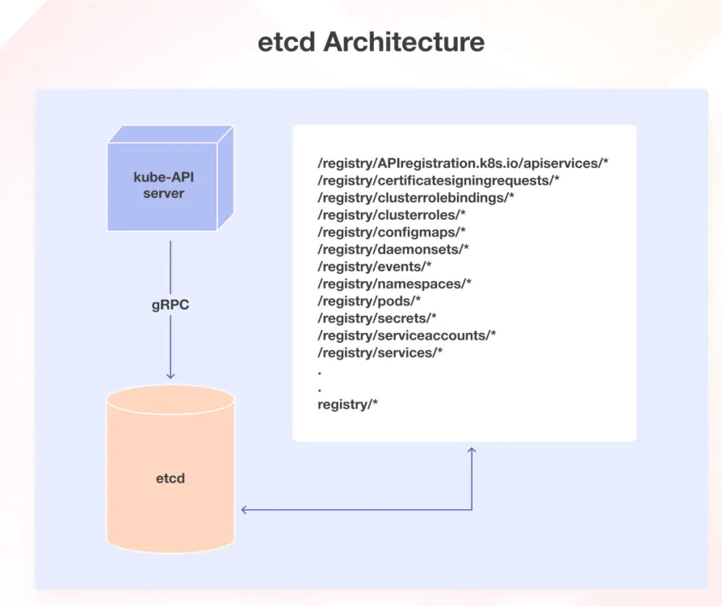
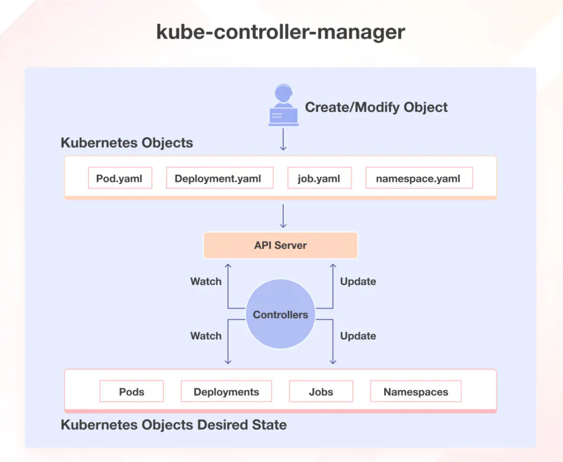
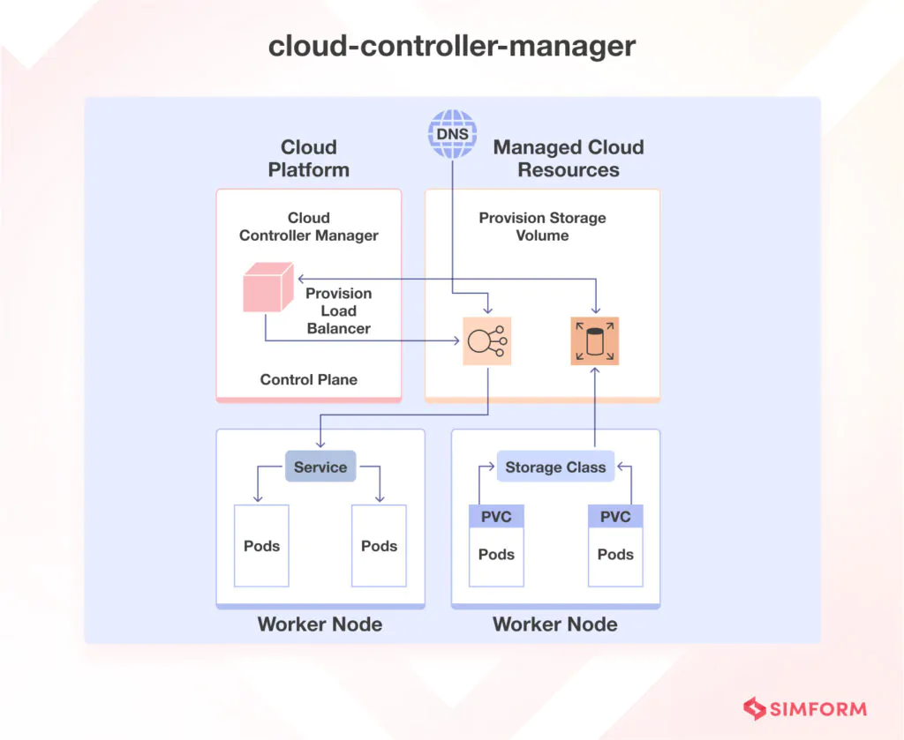
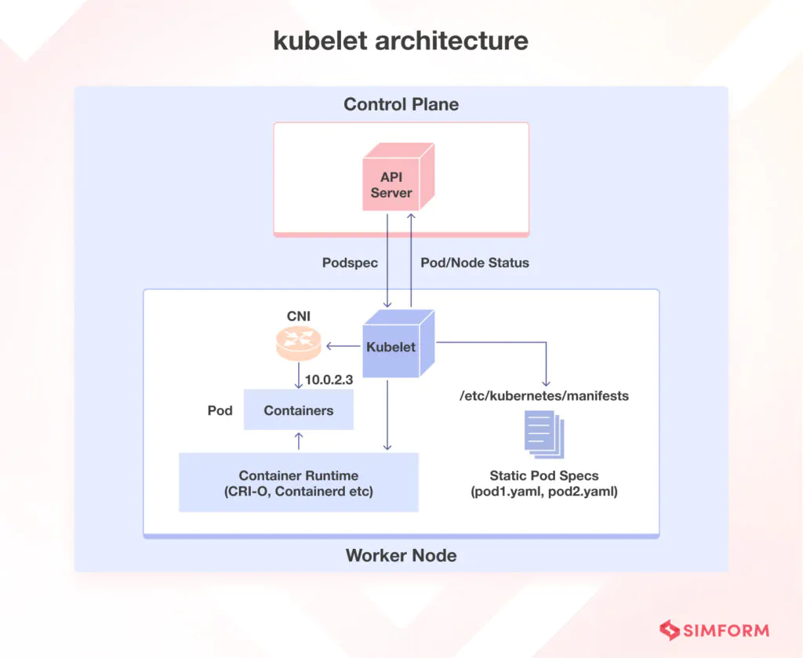
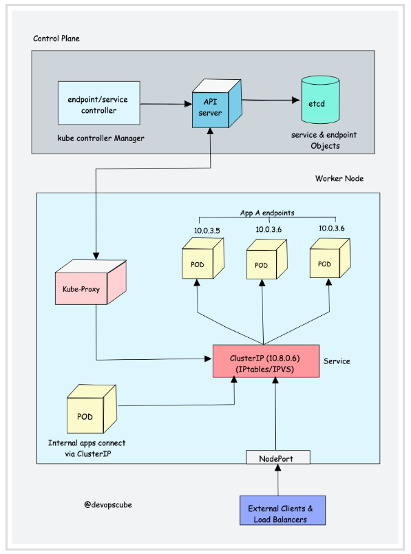
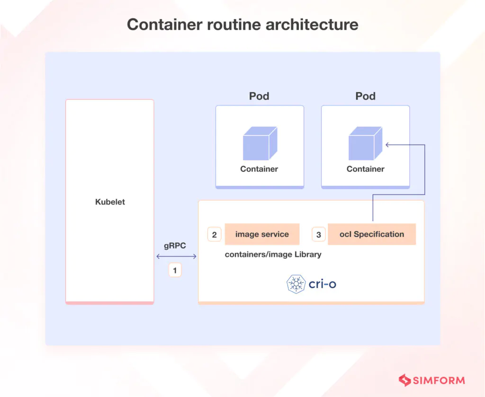
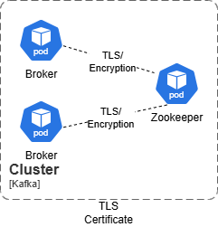
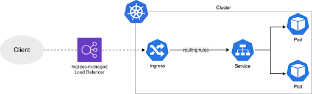

<div align="center">
<h1>Central Hub Infrastructure</h1>
<h2> 🏛️ System Architecture </h2>
</div>

## High Level System Architecture

<div align="center">

</div>

  ### Control Plane Node:

  - The control plane is responsible for container orchestration, making global decisions (e.g., scheduling), detecting/responding to cluster events, and maintains the state of a cluster.
  - The Kubernetes control plane consists of several components, each responsible for a specific task (as explained below). These components work together to ensure that each Kubernetes cluster’s state matches 
    the pre-defined desired state.

  1. **Kube-API server**

  ```mermaid 
  graph TB
    A[API Server] --> B[Master Node]
    B --> C[Scheduler]
    B --> D[etcd Cluster]
    B --> E[Controller Manager]

    A --> F[Worker Node]
    F --> G[Proxy]
    F --> H[Kubelet]
    F --> I[CLI]

    J[SDK-based Apps] --> A
    K[Monitoring Systems] --> A
    L[External Tools] --> A

    B -.->|Manages| J
    B -.->|Monitors| K
    B -.->|Integrates with| L
  ```

  - The kube-API server acts as the central communication hub for users, components, and the Kubernetes cluster. When using tools like kubectl, it communicates via HTTP REST APIs, while internal components such 
    as the scheduler and controllers use gRPC for interactions. The API server ensures secure communication through TLS, validating data for API objects, managing API requests, and authenticating and 
    authorizing users. It also coordinates processes between control plane and worker node components, ensuring smooth cluster operations.
  - Additionally, the API server exclusively interacts with etcd to store and retrieve cluster state information. It features a built-in bastion apiserver proxy, which enables external access to ClusterIP 
    services, providing a secure way to interact with the cluster's internal resources. This design allows the API server to serve as a robust and secure gateway for managing the Kubernetes ecosystem.


  2. **ETCD**:

  <div align="center">
  
  </div>

  ```mermaid 
  classDiagram
    class KubeAPI_Server {
        +gRPC etcd
    }

    class Etcd {
        +APIServiceRegistration
        +CertificateSigningRequests
        +ClusterRoleBindings
        +ClusterRoles
        +ConfigMaps
        +DaemonSets
        +Events
        +Namespaces
        +Pods
        +Secrets
        +ServiceAccounts
        +Services
        +OtherResources
    }

    KubeAPI_Server --> Etcd

    Etcd : +APIServiceRegistration
    Etcd : +CertificateSigningRequests
    Etcd : +ClusterRoleBindings
    Etcd : +ClusterRoles
    Etcd : +ConfigMaps
    Etcd : +DaemonSets
    Etcd : +Events
    Etcd : +Namespaces
    Etcd : +Pods
    Etcd : +Secrets
    Etcd : +ServiceAccounts
    Etcd : +Services
    Etcd : +OtherResources
  ```
  
  - etcd is a distributed key-value store designed to securely store Kubernetes cluster data, such as pod information, states, and namespaces. It is accessible only by the Kubernetes API server to ensure 
    security. Kubernetes interacts with etcd through its key-value API using gRPC, storing all objects in the /registry directory in key-value format.
  - The Kubernetes API server leverages etcd's watch feature to track changes to object states, enabling real-time updates and coordination. As the only StatefulSet component in the control plane, etcd serves a 
    as a reliable and robust database for managing Kubernetes cluster data.


  3. **kube-scheduler**:

  - The kube-scheduler selects the best worker node for a pod based on its requirements, such as CPU, memory, and affinity, leveraging etcd to store critical scheduling data. It filters nodes, scores them using 
    plugins, and binds the pod to the highest-scoring node, ensuring efficient and priority-based pod management while supporting custom plugins.

  4. **kube-controller-manager**:

  <div align="center">
  
  </div>

  - The kube-controller-manager manages various controllers to maintain the cluster's desired state. For instance, it ensures deployments specified in a YAML manifest, such as replicas, volume mounts, and 
    configmaps, remain consistent.
  - Key controllers include:
     - Deployment Controllers: Manage multiple replicas of containerized applications.
     - Replication Controllers: Ensure a fixed number of pod replicas are running, replacing failed pods automatically.
     - StatefulSet Controllers: Provide persistent storage, unique network identities, and controlled scaling for stateful applications.
     - DaemonSet Controllers: Ensure specific pods run on every node or selected nodes based on labels.

  5. **cloud-controller-manager**

  <div align="center">
  
  </div>

  - The cloud controller manager bridges Cloud Platform APIs and the Kubernetes cluster, enabling seamless integration between Kubernetes and cloud providers via plugins. It allows core Kubernetes components to 
    function independently while supporting cloud-specific functionality.
  - As in our setup we are using on-premise setup so CCM is not required for on-prem setup.

  6. **Promtail agent**:

  - On Controlplane node we are using promtail agent to collect logs and forward them to Loki for centralized log management. Promtail is responsible for discovering log sources, attaching metadata (such as pod 
    name, namespace, and labels), and forward logs to Loki. It can collect logs from system components like the kube-apiserver, kube-scheduler, and kube-controller-manager.


  ### Worker Nodes:
 
  - Worker nodes are critical components in a Kubernetes architecture because they help in running containerized applications.
  - Worker nodes are the primary execution units in a Kubernetes cluster where the actual workloads run. Each worker node can host multiple pods, each containing one or more containers running inside them. 
    Every worker node consists of three components responsible for scheduling and managing these pods:

  1. **Kubelet**:

  <div align="center">
  
  </div>

  - The kubelet is a vital Kubernetes component running on every node, responsible for node registration with the API server and managing pods based on the podSpec. It creates, modifies, and deletes containers, 
    handles probes (liveliness, readiness, and startup), mounts volumes, and reports node and pod status to the API server.
  - It accepts podSpec from sources like files, HTTP endpoints, and servers, leveraging the container runtime to pull images and run containers. During control plane bootstrapping, the kubelet starts the API 
    server, scheduler, and controller manager as static pods, ensuring pods remain in the desired state.

 2. **kube-proxy**:

  <div align="center">
  
  </div>

  - Kube-proxy is a key component in Kubernetes that implements Services for exposing pods to traffic. It works in conjunction with Kubernetes Service and Endpoint objects, where Services expose pods, and 
    Endpoints store their IP addresses and ports. Kube-proxy creates network rules to route traffic to the correct pods under a Service object, supporting protocols like UDP, TCP, and SCTP.
  - Running as a daemonset on every node, Kube-proxy interacts with the API server to retrieve details about Services and their associated pod IPs and ports. It monitors changes to services and endpoints, 
    updating routing rules accordingly. Kube-proxy operates in different modes, including IPTables, IPVS, Userspace, and Kernelspace. In IPTables mode, it manages traffic through IPtable rules, randomly 
    selecting a backend pod for load balancing.
 
 3. **Container runtime**:

  <div align="center">
  
  </div>

  - Just like the Java Runtime (JRE) is needed to run Java programs, a container runtime is essential for running containers. It handles tasks like pulling images from registries, allocating resources, 
    isolating containers, and managing their lifecycle on a host.
  - Kubernetes communicates with container runtimes through the Container Runtime Interface (CRI), which defines APIs for container creation, starting, stopping, and deletion, as well as managing images and 
    networks. The Open Container Initiative (OCI) establishes standards for container formats and runtimes. Kubernetes supports multiple CRI-compliant runtimes, such as CRI-O, Docker Engine, and containerd. The 
    kubelet agent interacts with the container runtime using CRI APIs to manage containers and report container information to the control plane.

 4. **Postgres SQL**:

  - We are using postgres in our infra as a database to store the data of different central-hub applications with AES-256 encryption algorithm.
  - In our infra we are using kubegres to manage the posrgres, as kubegres is a kuberntes operator who manages the deployment, scaling etc of the postgres.
  - We used postgres in our infra because of its advanced features like supports SQL and JSON, able to manage structured and unstructured data, provides strong security with encrypted data by using AES-256 
    encryption algorithm.

 5. **Kafka**:

  <div align="center">
  
  </div>
  
  - We are using kafka in our infra for collecting and storing real time data from the different sources like alerts, event-authentication, technical alerts, sdc events etc.
  - Kafka is a distributed event platform which uses producers to sent messages to different topics, where consumer can read that message by subscribing the relevant topics. We are using zookeepr for managing 
    kafka cluster state and its high availability.
  - We are using **Strimzi Operator** in our infra for managing the apache kafka on the kubernetes where strimzi is a kubernetes operator which simplifies the deployment and management of the kafka.
  - We used kafka as it is known for high throughput with real time data stream, fault tolerance. It make sures of data reliability and low letency communication and easy to integrate.

 6. **Redis**:

  - We used redis in our infra for caching, session management, storing user state of our different central hub applications.
  - We choose redis because it provides features like high performance as an in memory data store, supports complex data structure, faster and more scalable for caching, flexible. It supports pub/sub messaging, 
    ensuring fast, scalable, and reliable performance.

 7. **Monitoring**:

  - We are using different dashboards like kubernetes dashboard, Grafana Dashboard, Loki Dashboard for different monitoring purpose.
    - **Kubernetes Dashboard**:
      - We used kubernetes dashboard in our infra setup to monitor the health, cluster state, logs, performance of all the kubernetes resources like pods, jobs, deployment, replicaset, services etc. 
    - **Loki Dashboard**:
      - We are using loki dashboard to display the audit related logs and pod related logs.
    - **Grafana Dashboard**:
      - We are using Grafana dashboard to show color coded visulisation of the different alerts coming from the prometheus with the different views of the current alert. its status, also with the table formate.
     
 8. **Ingres Loadbalancer**:

  <div align="center">
  
  </div>

  - We used ingres loadbalancer in our infra setup to route the traffic to appropriate backend services based on the routing rules we have provided such as URL path, http, https, hostname etc.
  - We choose ingres as a loadbalancer because it offers centralized traffic management, path-based routing, and SSL termination. we can use the same ingress loadbalancer for different application with single 
    yaml file just with the routing rules.


 9. **Istio**:

  - We are using istio in our infra to encrypt the communication between service to service by enabling the mTLS (mutual TLS) protocol, where authentication required from both the end which makes communication 
    more secured.
  - We used istio for this becaue it provides a great features like advanced traffice management, secured communication using mTLS protocol, supports both kubernetes and VM-based environment, more flexible for 
    large scale and multi node cluster.
  
 10. **Kubernetes Objects**:

 - **Deployment**:
   - We are installing our central-hub application as deployment as deployment manages the desired state of application replicas which provides the **high availability**, also with replicas it is easy to 
     scale up/down the application, Also with deployment It is easy to roll back to old version or roll our new version of the application.

 - **Pod**:
   - A Pod is the smallest deployable unit in Kubernetes, representing a single instance of a running process. It can contain one or more tightly coupled containers that share the same network namespace, 
     storage volumes, and configuration.

 - **Static Pod**:
   - A pod directly managed by the kubelet, defined via static configuration files on a node. Static pods are not part of a Deployment or ReplicaSet and are typically used for critical control plane 
     components.

 - **Service Account**:
   - We used Service Account in Kubernetes as an identity used by processes running inside pods to interact with the Kubernetes API. It provides an authenticated and authorized way for pods to access r 
     resources in the cluster.

 - **Secret**:
   - We used secret in our infra to store the sensitive information like password, key, certificate, tokens in a encryption form, which use by the pods or a service to access the credentials or other 
     sensitive data without exposing it in a plain text. By using this we can **secured** our sensitive data.
   - Secret are encrypting data with **base64 encryption** algorithm.
     
 - **Configmap**:
   - We used configmap to store a non-sensitive data in a key value pair in a plaintext formate as it is latter used by the application and retrieve configuration settings like database URLs, environment 
     variables, or feature flags, making it easier to manage and update configurations without modifying the application.

 - **Cluster role and role binding**:
   - We are using clusterrole and rolebinding to restrict the access of service account to limited resoueces with limited rights.
   - Where A ClusterRole is a set of permissions that can be applied across the entire cluster, granting access to resources like nodes, namespaces, or persistent volumes. ClusterRoles are often used for 
     cluster-wide access or in cases where the same role needs to be applied to multiple namespaces and A RoleBinding is used to bind a Role or ClusterRole to a user, service account, or group, granting them 
     the specified permissions within a particular namespace (RoleBinding) or across the entire cluster (ClusterRoleBinding).

 - **StatefulSet**:
   - We are using statefulset for the postgressql in our setup as statefulset is used when you want to manage the state of the any application also It ensures stable, unique identities and persistent storage 
     for each pod, which is useful for databases and distributed systems.

 - **Namespace**:
   - We are using different different namespaces in our setup to isolate the different resources like for central-hub application we are using central-hub namespace, for k8s dashboard we are using dashboard 
     namespace, for ingress-nginx we are using ingres-nginx namespace etc.
