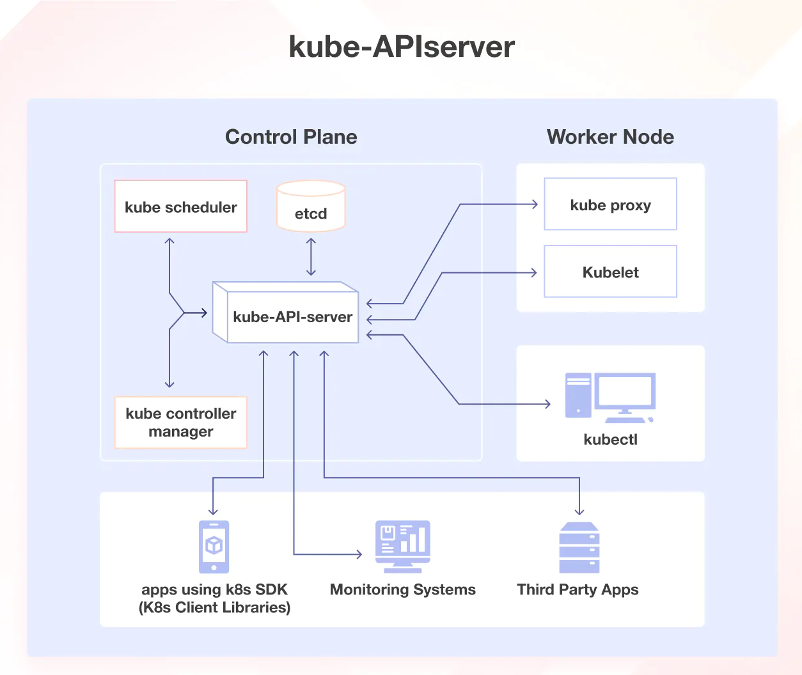

<h1>Central Hub Infrastructure</h1>
<h2> 🏛️ System Architecture </h2>

## High Level System Architecture

  ### **Control Plane Node**:

  - The control plane is responsible for container orchestration, making global decisions (e.g., scheduling), detecting/responding to cluster events, and maintains the state of a cluster.
  - The Kubernetes control plane consists of several components, each responsible for a specific task (as explained below). These components work together to ensure that each Kubernetes cluster’s state matches 
    the pre-defined desired state.

  1. **Kube-API server**

  

  
  

  - The kube-apiserver is Kubernetes' central control component. It handles requests (e.g., from kubectl), authenticates and validates them, updates the etcd datastore, and coordinates all cluster 
    operations. Other components like the scheduler, controller-manager, and kubelet interact with the cluster solely through the kube-apiserver.

  2. **ETCD**:
  - ETCD is a distributed key-value store used by Kubernetes to securely store cluster data like pod states and namespaces under the /registry directory. Accessible only by the API server via gRPC, it 
    supports state tracking through its watch feature, making it a critical StatefulSet component for Kubernetes.

  4. **kuber control manager**:
  5. 
