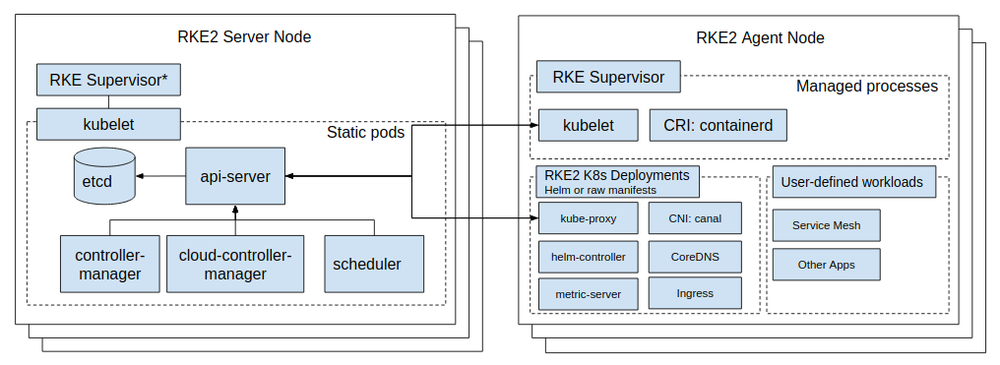

<h1>Central Hub Infrastructure</h1>
<h2> ⚜️ Detailed Design </h2>

### Rancher:

- We are using Rancher in our infra for creating and managing the kubernetes cluster of one master node, three worker nodes, and one load balancer.
- Rancher is a complete container management platform for Kubernetes, giving you the tools to successfully run Kubernetes anywhere
- In our setup we are deploying rke2 service using helm chart and installing the service on each node by using ansible, where on master node we are installing the "rke2-server" service, and on the worker nodes 
  we are installing "rke2-agent" service.

**How it works**
- Rancher uses Kubernetes as its core and manages cluster configurations via the Kubernetes API.
- It deploys a lightweight Kubernetes distribution called RKE (Rancher Kubernetes Engine) for creating clusters quickly.
- Rancher works as a centralized platform for managing Kubernetes clusters across diverse environments, whether on-premises, in the cloud, or at the edge.
- Rancher integrates with enterprise-grade tools for authentication, monitoring, logging, and alerting, such as LDAP, Active Directory, Prometheus, and Grafana, providing a comprehensive ecosystem for Kubernetes 
  management. 
### Kafka Cluster:

- We are using kafka in our infra for collecting and storing real time data from the different sources like alerts, event-autheProducers and Consumers Work Independently:ntication, technical alerts, sdc events 
  etc.
- Kafka is a distributed event streaming platform designed to handle high-throughput, fault-tolerant, and low-latency messaging. Here's a simplified overview of how it works:

    * **Topic**: Data is organized into categories called topics. Producers write messages to these topics, and consumers read them.
    * **Producers**: Producers are applications that send data (events) to Kafka topics. They push messages in a serialized format.
    * **Consumers**: Consumers are applications that subscribe to topics and read messages. They can read at their own pace, and Kafka retains messages for a configurable time.
    * **Partitions**: Topics are divided into partitions for scalability. Each partition can reside on a different Kafka broker, allowing for parallel processing.
    * **Brokers**: Kafka runs on a cluster of servers called brokers. Each broker stores partitioned data and manages its replication for fault tolerance.
    * **Replication**: Kafka replicates partitions across brokers to ensure data availability in case of failures.
    * **Consumer Group**: Consumers can belong to consumer groups for load balancing. Each partition is processed by only one consumer in a group, enabling horizontal scalability.
    * **Producers and Consumers Work Independently**: Producers and consumers work asynchronously. Producers can write messages without waiting for consumers to process them.

#### Workflow Example:

- A producer sends a message (e.g., a log entry) to a Kafka topic.
- The message is stored in a partition on one or more brokers.
- A consumer subscribes to the topic, retrieves the message, and processes it (e.g., storing it in a database).

### Istio:

- We are using istio in our infra to encrypt the communication between service to service by enabling the mTLS (mutual TLS) protocol, where authentication required from both the end which makes communication 
  more secured.
- As you can see in the image all the central hub components are communicating with each other using mTLS (mutual TLS) protocol.
- Istio is a powerful service mesh that provides advanced traffic management, security, and observability for microservices architectures. It simplifies the management of communication between services by 
  offering features like load balancing, traffic routing, service discovery, and fault tolerance. Istio enhances security by enabling mTLS (mutual TLS) for service-to-service encryption.

**What is mTLS Protocol**

- mTLS (mutual TLS) is a protocol extension of the standard TLS (Transport Layer Security) protocol. While TLS typically provides encryption and authentication for data transmitted over a network, where mTLS 
  goes a step further by requiring both the client and the server to authenticate each other.

**How it works**

- The server presents a certificate to authenticate itself to the client.
- The client also presents its own certificate to authenticate itself to the server.

- This mutual authentication ensures that both parties are verified, enhancing the security of communication, especially in service-to-service interactions in microservices architectures.

###

| **Protocol** | **Port**          | **Source**                  | **Destination**              | **Description**               |
|--------------|-------------------|-----------------------------|------------------------------|--------------------------------|
| TCP          | 9345             | Kubernetes worker nodes     | Kubernetes control plane nodes | RKE2 supervisor API           |
| TCP          | 6443             | Kubernetes worker nodes     | Kubernetes control plane nodes | Kubernetes API                |
| TCP          | 10250            | All Kubernetes nodes        | All Kubernetes nodes          | kubelet metrics               |
| TCP          | 2379             | Kubernetes control plane nodes | Kubernetes control plane nodes | etcd client port              |
| TCP          | 2380             | Kubernetes control plane nodes | Kubernetes control plane nodes | etcd peer port                |
| TCP          | 2381             | Kubernetes control plane nodes | Kubernetes control plane nodes | etcd metrics port             |
| TCP          | 30000-32767      | All Kubernetes nodes        | All Kubernetes nodes          | NodePort port range           |
| UDP          | 8472             | All Kubernetes nodes        | All Kubernetes nodes          | Cilium CNI VXLAN              |
| TCP          | 4240             | All Kubernetes nodes        | All Kubernetes nodes          | Cilium CNI health checks      |
| ICMP         | 8/0              | All Kubernetes nodes        | All Kubernetes nodes          | Cilium CNI health checks      |
| UDP          | 49152-65535      | Patient Monitors            | All Kubernetes nodes          | SDC                           |
| UDP          | 3702             | Patient Monitors            | All Kubernetes nodes          | SDC discovery                 |

