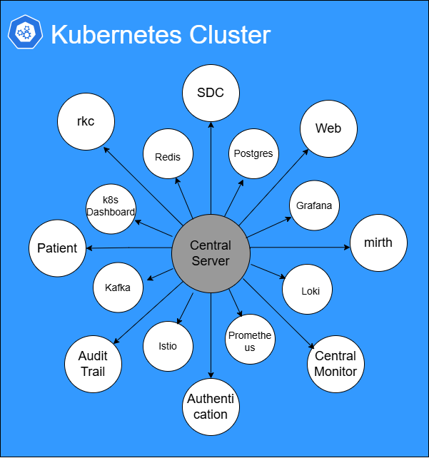

<h1>Central Hub Infrastructure</h1>
<h2> 🎯 Introduction </h2>

### Purpose

The purpose of this Infrastructure document is to provide a detailed description of the Central hub Infra, design decisions, and design detailed understanding. This document will offer a clear and thorough understanding  to end users of how our infrastructure is designed to provide high availability, reliability, and seamless operation. Additionally, it also explains the functionality and interaction of its various components to provide a  robust and efficient system.

### Scope

The infrastructure is designed for robust and scalable for deploying, managing, and maintaining applications, ensuring high availability, reliability, and secure communication. This infrastructure includes different tools like docker, Kubernetes, ansible, helm chart, terraform, grafana, Loki, etc for seamless operation, deployment, upgrade/downgrade, monitoring, and scalability.

The scope of the infrastructure includes:

- High Availability and Scalability
- Easy Deployment
- Data Security and Encryption
- Backup and Disaster Recovery
- Logging and Monitoring

### System Overview

The infrastructure is the reason for running and managing applications in a secure, scalable, and reliable environment. It is designed in such a way as to provide high performance, smooth operation, and seamless communication between different components.

The infrastructure comprises one master node, three worker nodes, and one load balancer node.
1. Master Node: The Master node is responsible for container orchestration, maintaining cluster state, scheduling pods, and maintaining replication count.
2. Worker Node: These are the nodes on which we are running the different application containers. The master node manages each node.
3. Load Balancer Node: This node will distribute the traffic and provide HTTP/HTTPS-based routing.

