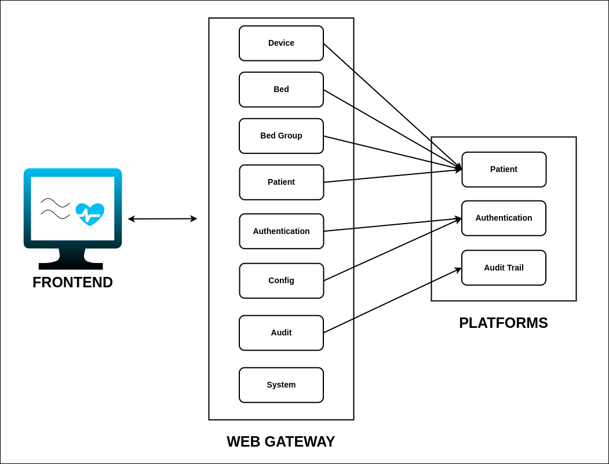

<div align="center">
<h2>⚜️ Component Design Description</h2>
</div>

### **High Level System Architecture**

The Web Gateway serves as a middleware component, enabling secure and efficient communication between users, devices, and central hospital systems. It handles authentication, patient management, bed management, and device interactions through REST API endpoints. Below is a detailed breakdown of the key components involved in the system architecture.



#### **System Components**

- **Frontend (User Interface)**:  
  A web-based UI designed for both clinicians and technical staff.  
  - **For Clinicians**:  
    Displays vital information, such as patient details, bed assignments, device statuses, and alert notifications.  
  - **For Technical Staff**:  
    Provides tools to manage EHR (Electronic Health Record) configuration.

- **Web Gateway**:
  - Acts as a middleware layer, exposing secure REST API endpoints to the frontend and other external systems.
  - Handles key functions like user authentication, authorization, data validation, and management.

- **Hospital Network**:
  - Ensures secure communication between the Frontend and Platform through the Web Gateway.
  - Implements network-level security protocols to safeguard data.

---

### **Web Gateway Class Diagram**


### **Web Gateway Flow Architecture**


### **Core Services Explained**

| Service                     | Description                                                                                              |
|-----------------------------|----------------------------------------------------------------------------------------------------------|
| **Authentication**          | Facilitates secure login, session management, token handling, and password updates by forwarding requests to the authentication platform. These operations ensure robust access control and security. |
| **Patient**                 | Manages the creation, retrieval, updating, and deletion of patient information. All interactions are facilitated through the patient platform. |
| **Bed**                     | Handles all bed-related operations, including the creation, updating, retrieval, and deletion of beds, through interactions with the patient platform. Bulk operations are supported for efficient management. |
| **Bed Group**               | Manages bed groups, enabling the creation, updating, deletion, and retrieval of group information. It also handles operations to assign or retrieve beds within specific groups by sending requests to the patient platform. |
| **Device**                  | Manages devices, including patient monitors and sensors. Operations include retrieving device details, updating configurations, and assigning devices to beds. All interactions are facilitated through the patient platform. |
| **Audit Trail**             | Retrieves and manages audit trail records to ensure accountability and compliance. It interacts with the audit trail platform to log and retrieve detailed records of actions performed on system entities. |
| **Config**                  | Provides endpoints for retrieving and updating EHR integration configuration settings. It interacts with the authentication platform. |
| **System**                  | checks if the system is running properly and responds with a confirmation that Healthy. |

---

### **Environment Configuration**

The following .env file contains the necessary environment settings for development and deployment.
```
LOG_LEVEL=
GUNICORN_WORKERS=
SENTRY_DSN=
SENTRY_TRACE_SAMPLE_RATE=
SENTRY_PROFILES_SAMPLE_RATE=
ENVIRONMENT=
SIBEL_VERSION=
APPLICATION_PORT=
BASE_PATH=
APP_DOMAIN_NAME=
AUTH_V2_ENABLED=
PM_STATE_TOPIC=
PATIENT_PLATFORM_BASE_URL=
EHR_PLATFORM_BASE_URL=
DEVICE_PLATFORM_BASE_URL=
AUDIT_PLATFORM_BASE_URL=
AUTH_PLATFORM_BASE_URL=
AUTH_PLATFORM_V2_BASE_URL=
PUBLISHER_BACKEND=
PUBLISHER_DEVICE_COMMAND_STREAM_NAME=
JWT_VERIFYING_KEY=
DEFAULT_CLINICAL_USERNAME=
DEFAULT_TECHNICAL_USER_USERNAME=
CORS_ORIGINS=
KAFKA_HOST=
KAFKA_PORT=
KAFKA_PASSWORD=
KAFKA_CA_FILE_PATH=
KAFKA_CERT_FILE_PATH=
KAFKA_KEY_FILE_PATH=
KAFKA_RETRY_BACKOFF=
KAFKA_METADATA_MAX_AGE=
DEVICE_COMMAND_RESPONSE_TOPIC=
REDIS_HOST=
REDIS_PORT=
REDIS_USERNAME=
REDIS_PASSWORD=
REDIS_CACHE_TTL=
PROJECT_NAME=
PM_COMMAND_EXECUTION_ENABLED=
KAFKA_HEALTHCHECK_TOPIC=
```