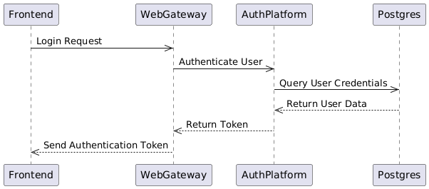
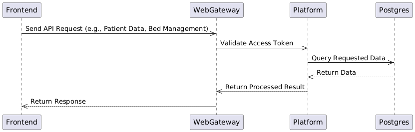
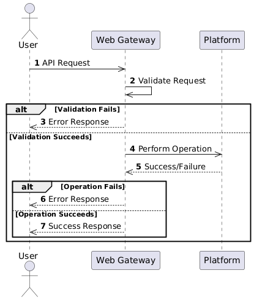
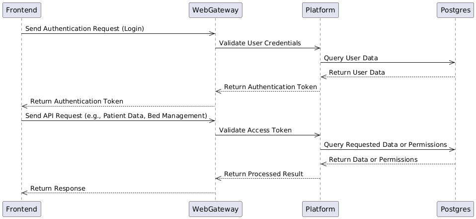

<h2>⚜️ Web Gateway Workflow and Algorithms</h2>

This document outlines the workflows and algorithms that govern the interactions within the Web Gateway system.

## Overview

The Web Gateway acts as the communication interface between the frontend user interface and the backend platform services. The Web Gateway ensures secure access flow between the user, platform, and data storage systems (Postgres). Below are the main workflows covered:

## 1. Authentication Workflow

The authentication process starts when the user sends a login request. The Web Gateway validates the credentials through the AuthPlatform, which then queries the Postgres database for user credentials. If successful, the Web Gateway returns an authentication token to the user.

---

## 2. API Request Handling Workflow

Once authenticated, the user can make API requests (e.g., retrieving patient data, managing beds). The Web Gateway validates the access token, queries the platform, and interacts with Postgres to retrieve or modify data.

### Sequence Diagram

---

## 3. Error Handling and Response Workflow

This workflow demonstrates how the Web Gateway handles validation failures, operation failures, and successful responses. The sequence is designed to ensure that the user is informed of errors or successful operations.

---

## 4. Combined Workflow for Authentication and API Requests

This workflow combines the authentication process and the handling of API requests in a single sequence. It provides a comprehensive view of the system's interaction flow.

