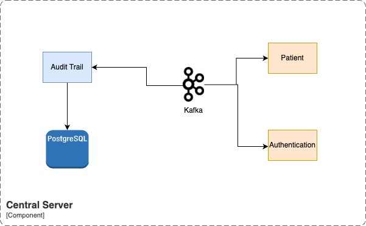
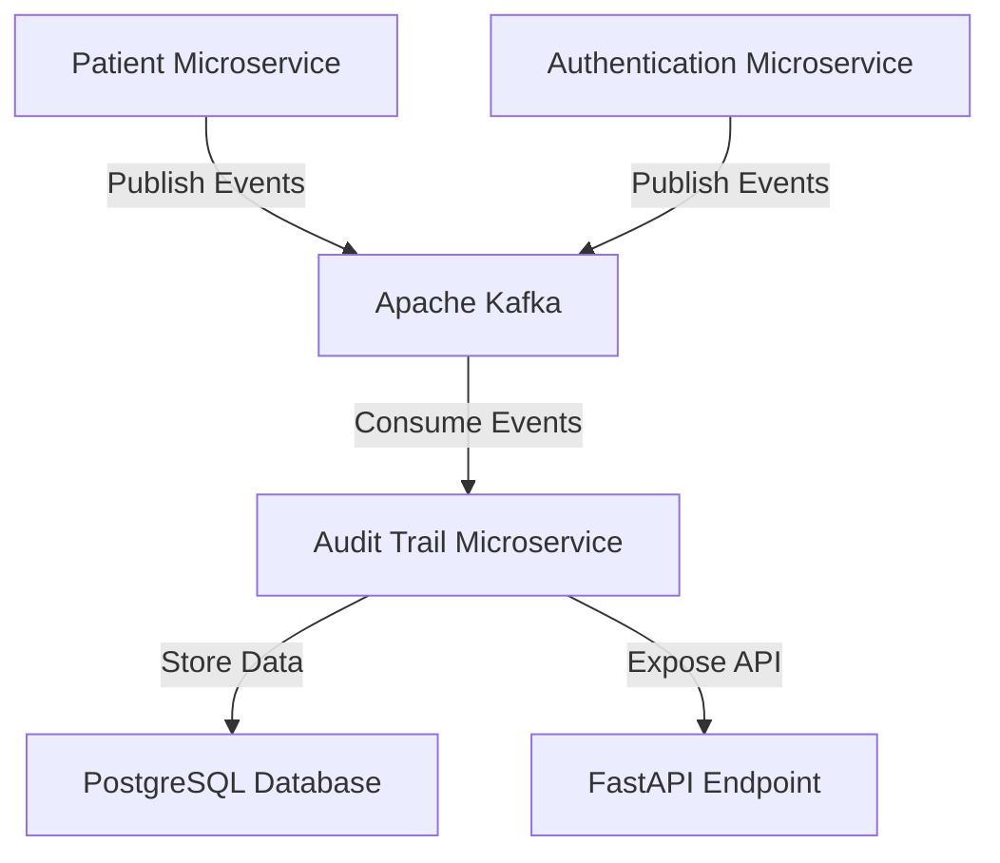
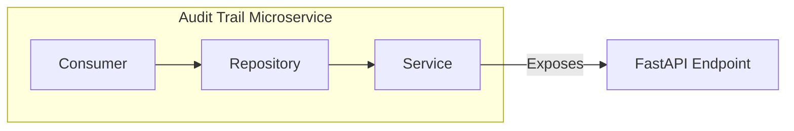

<h1>Audit Trail</h1>
<h2> 🏛️ System Architecture </h2>

### **High Level System Architecture**

The architecture involves several system components, including a central server that operates alongside Kafka streaming services and a PostgreSQL database for storing audit trails. The Audit Trail microservice consumes data related to patients, devices, authentication, and user activities by consuming event-based messages from the Kafka service and storing them in the PostgreSQL database.

- **Kafka**
    - Kafka serves as the message broker in the architecture.
    - The service shall handle the subscriptions to important Patient events, device events, authentication data and the corresponding alerts. 
    - All incoming data shall be consumed from Kafka so that audit logs can be stored in postgreSQL for audit purpose.
    - Ensures connection with Kafka services and PostgreSQL services are up and running

- **PostgreSQL**
    - Postgres serves as a data storage in the architecture.
    - All incoming event shall be stored in structured formate in postgreSQL table for audit log purpose.
    - Ensures device connection statuses are updated and validated
    - Key Responsibilities:
	  - Sends Device, Vitals, Waves, alerts and all data events to paient and realtime gateway services.

### **Audit Trail Flow Architecture**

|Package Name|	Description|
|------------|-------------|
|Consumer|	A continuously running process that listens to Kafka topics (patient, device, authentication events).|
|Repository|	_AuditEventRepository_ Handles queries to the PostgreSQL database, mapping them to Python native classes.|
|Service|	Applies business logic to operations and formats responses for the API endpoint.|

### **Data Schema for the Events**
The PostgreSQL database schema for storing events includes the following fields:

|Field Name|	Description |
|----------|----------------|
|Message ID|	Unique identifier for the message. |
|Entity ID	|Identifier of the associated entity (e.g., patient, device). |
|Timestamp	|Time when the event occurred.|
|Event Name|	Descriptive name of the event.|
|Current State|	State of the entity after the event.|
|Previous State|	State of the entity before the event.|
|Emitted By|	Source microservice that emitted the event.|
|Performed By|	User or system responsible for the event.|

### **Error Handling**
When errors occur during message processing, the following actions are taken:
* Error Logging: Errors are logged for subsequent analysis.
* Message Continuation: Processing continues with succeeding messages to avoid system downtime.

### **API Endpoint Design**
The FastAPI endpoint allows users to retrieve the audit trail logs. The endpoint details are as follows:
|Endpoint|	Method|	Description|
|--------|--------|------------|
|/audit-trail/logs|	GET	|Retrieves the stored audit trail logs.|

### **Integration Diagram**
