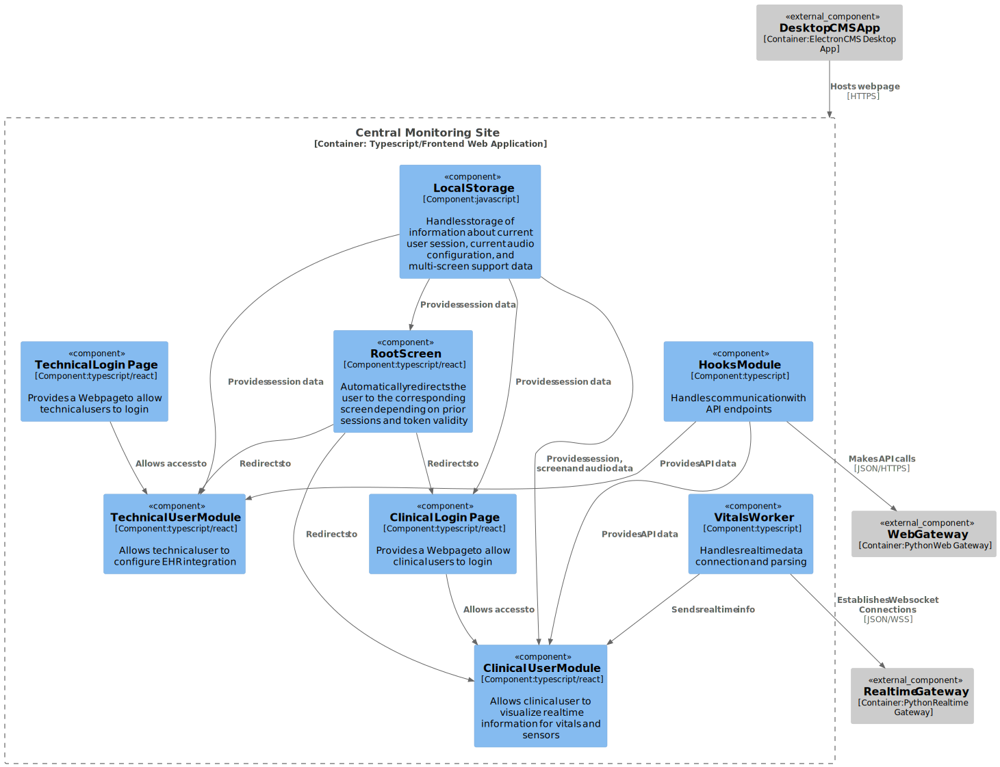

# Component Design Description

The central monitoring site architecture can be broadly divided into three different layers. The Data Layer, the Clincial Layer, and the Technical Layer. There is also a Root Screen outside of these layers which allows the application to quickly redirect the user to either clinical or technical modules depending on previous app usage.

## Data Layer

The Data Layer handles information storage and communication with outside services. It has three main components

### Local Storage

Handles the storage of data about current session and current configuration. No patient or sensor data is ever stored in here, nor any other type of PHI/PII. It provides information for both the Technical and Clinical layers as needed

### Hooks Module

Handles communication with API endpoints, by communicating directly with the Web Gateway. It also stores the information received on memory to minimize amount of calls to APIs by both the Clinical and Technical Layers

### Vitals Worker

Handles Websocket connection with the Realtime Gateway. Receives patient vitals and system events and communicates them to the Clinical layer for proper information display. This worker is the only part of the application that runs on a different thread (specifically a web worker) than the rest of the CMS application

## Clinical Layer

The Clinical Layer handles the use cases for Clinical Users. These include authentication, vitals monitoring, and data management among others. It has two main components

### Clinical Login Page

When a clinical user hasn't been authenticated it can only access this component, and it's only functionality is to authenticate a clinical user with correct credentials. Credential validation is done by communicating through the Hooks Module, and it allows access to the Clinical User Module

### Clinical User Module

The Clinical User Module handles every non-login use case for a clinical user. It allows the user to visualize the realtime and session historical data available, manage internal data such as beds and groups, as well as simple use cases such as logout and audio management.

This module heavily relies on all components in the Data Layer for data handling.

## Technical Layer

The Technical Layer handles the use cases for Technical Users. These includes the authentication and EHR Integration flows. It has two main components

### Technical Login Page

When a technical user hasn't been authenticated it can only access this component, and it's only functionality is to authenticate a technical user with correct credentials. Credential validation is done by communicating through the Hooks Module, and it allows access to the Technical User Module

### Technical User Module

The Technical User Module handles every non-login use case for a technical user. It allows the user to configure the EHR Integration, communicating through the hooks modules. It also handles simple use cases such as logout

## Diagram

Here is the C3 diagram of this site:

