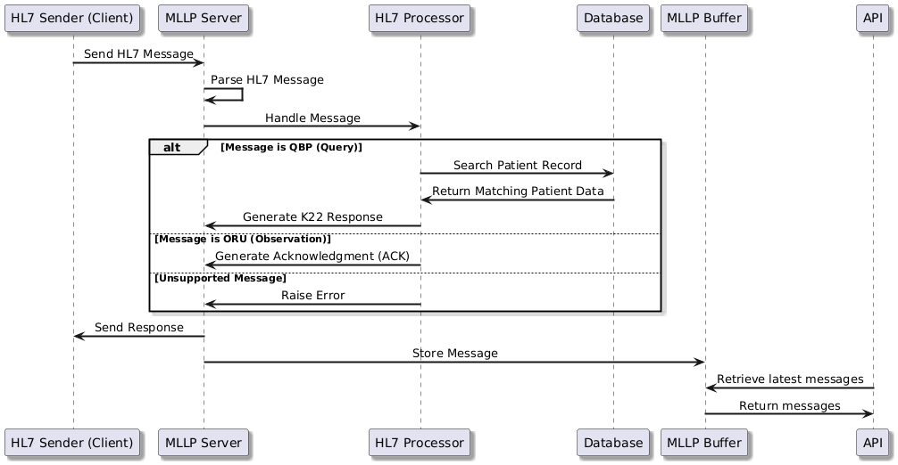
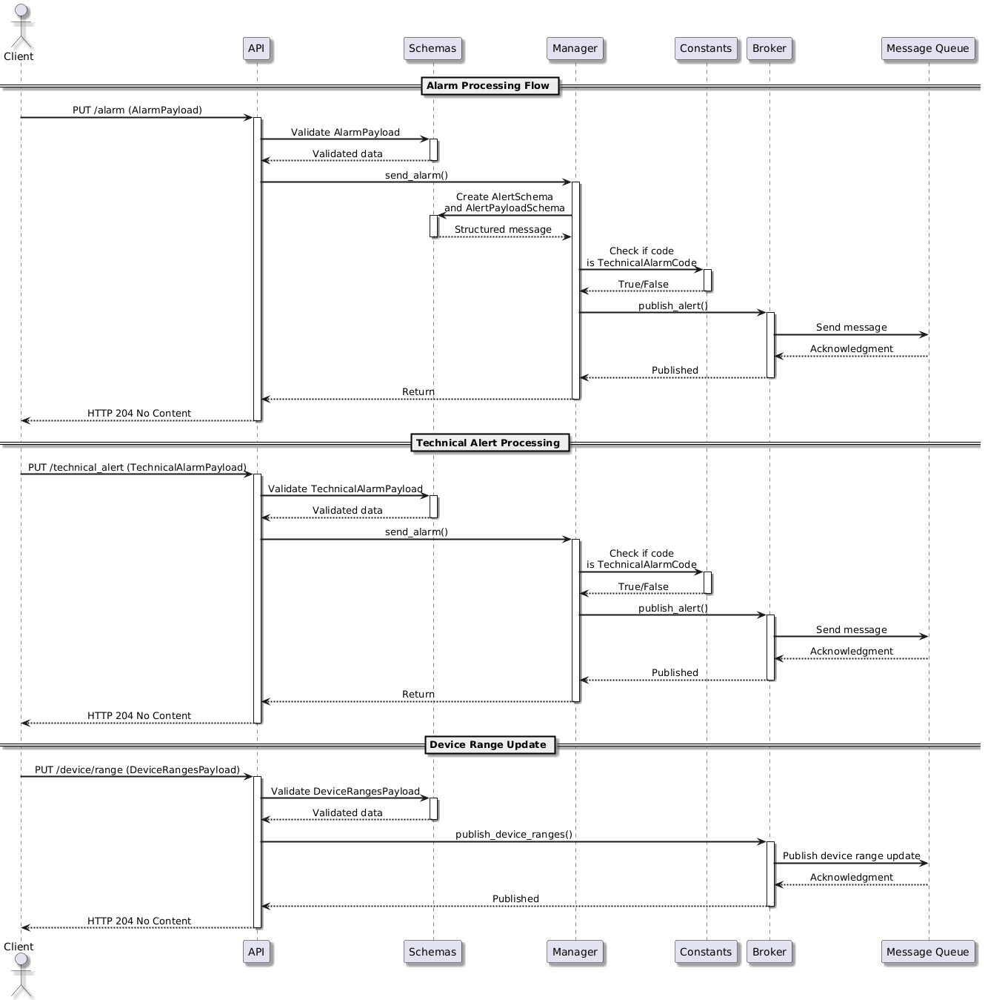
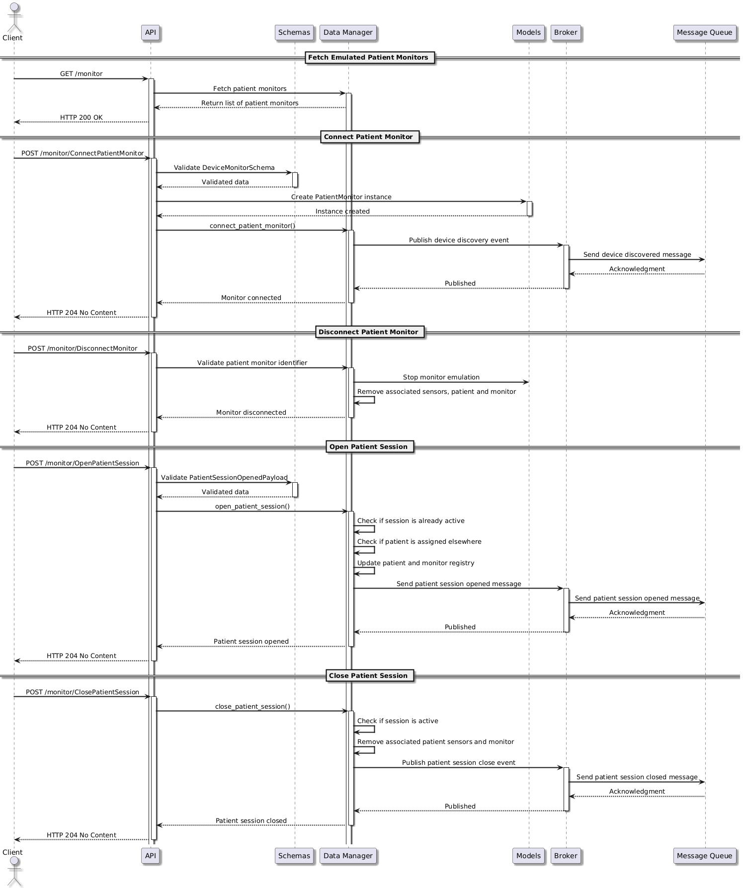
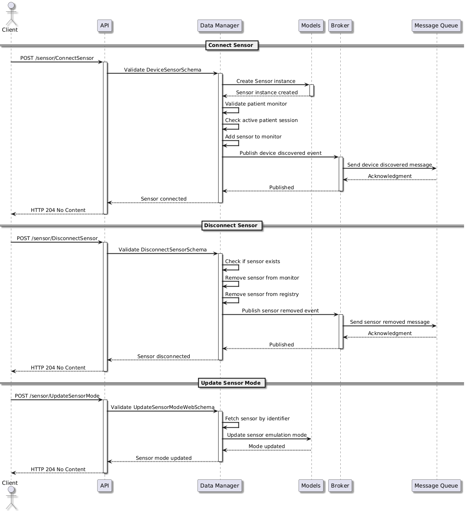
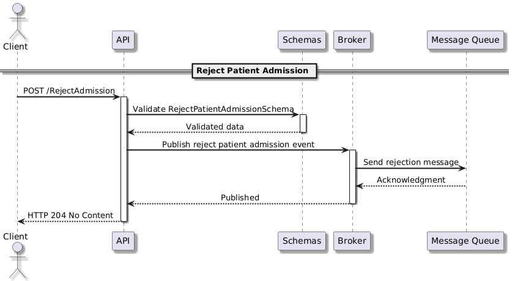

<h2>⚜️ Workflow and Algorithms</h2>

This document outlines the workflows and algorithms that govern the interactions within the Emulator.

## Overview

The Emulator is designed to simulate virtual devices. Below are the main workflows covered:

## 1. MLLP Workflow

The system flow begins when an HL7 message is sent to the MLLP Server. The message is parsed, and the HL7 Processor handles it depending on the message type. If it's a query message (QBP), it queries the database for patient data. If it's an observation message (ORU), an acknowledgment is generated. Unsupported messages trigger an error. The system then responds to the sender and stores the message in the buffer. Finally, the API allows the retrieval of the latest messages.

---

## 2. Alarm Workflow

The alarm processing system begins when a client sends an alarm, technical alert, or device range update request to the API. The API validates the payload and forwards it to the alarm manager. The manager processes the alarm by structuring the data into alert schemas, determining if it qualifies as a technical alert, and then publishing it via the broker. The broker relays the message to a message queue for further handling. For device range updates, the broker directly publishes the updated range information. The system ensures efficient handling by acknowledging messages and returning HTTP 204 No Content responses to the client.

---

## 3. Monitor Workflow

The patient monitor system flow begins when a client interacts with the API to manage patient monitors, sensors, and sessions. The API validates incoming requests and delegates tasks to the Data Manager, which maintains patient monitor states and sensor connections. When a monitor is connected or a session is opened, the system updates its registry and publishes relevant events through the broker. Disconnecting monitors or closing patient sessions triggers corresponding event publications. The system ensures smooth operation by handling device discovery, session tracking, and real-time patient monitoring updates, responding with HTTP 204 No Content for successful operations.

---

## 4. Sensor Workflow

The sensor management system begins when a client interacts with the API to connect, disconnect, or update a sensor's mode. The API validates the request and delegates operations to the Data Manager. When a sensor is connected, the system ensures it is assigned to an active patient session and publishes a discovery event. Disconnecting a sensor removes it from both the patient monitor and registry while publishing a removal event. Updating a sensor's mode modifies its emulation settings. The system ensures consistency by maintaining proper registry updates and responding with HTTP 204 No Content for successful operations.

---

## 5. Admission Workflow

The patient admission rejection process begins when a client sends a request to the API to reject a patient's admission. The API validates the request and publishes an event via the broker. The broker then sends the rejection message to the message queue, ensuring the rejection event is properly handled. The system acknowledges the request and responds with HTTP 204 No Content, indicating successful processing.

