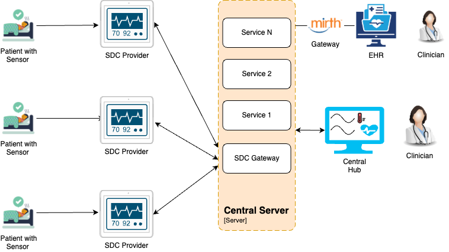
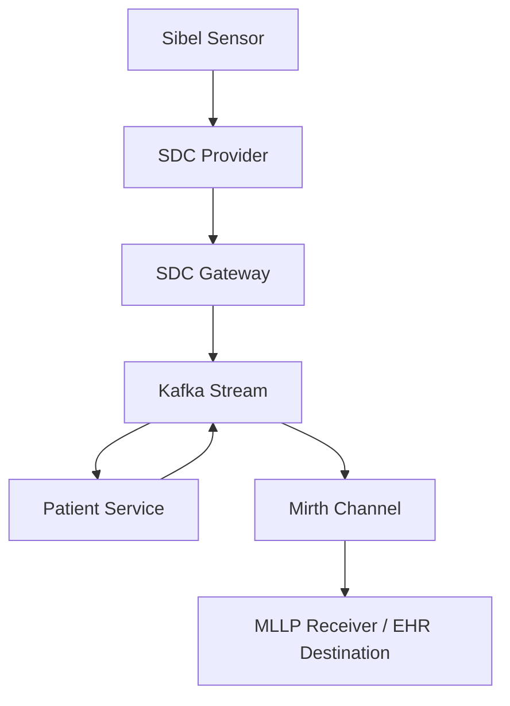

<div align="center">
<h1>HL7 & Mirth Gateway</h1>
<h2> 🏛️ System Architecture </h2>
</div>

### **High Level System Architecture**

The system components involved in the architecture where sensors are connected to a SDC Provider(patient monitor), which is then connected to a server over the hospital network using the SDC protocol, and where the SDC Gateway consumes patient data and displays the results on a Central Server monitored by a clinician, Observed patient vitals, Patient information are consumed/transformed to Hospital's EHR system using HL7 message standard through Mirth connect channel are as follows:




### **Mirth Gateway Flow Architecture**



The diagram represents the architecture of the Mirth Gateway, which facilitates communication, data processing, and coordination between components such as Mirth Gateway, Kafka Stream, and various Central Server services. Mirth Channel contain source and destination, which interact with connected EHR (e.g EPIC, Cerner) as external systems.


### **Component Design**

The sequential representation of the aforementioned components is illustrated below. This sequence diagram highlights the interactions among the components, emphasizing the order of messages exchanged to fulfill the scenario's functionality. Messages are represented by arrows indicating the flow of communication. This diagram serves as a visual guide to understanding the dynamic behavior of the Mirth Gateway.

```mermaid
sequenceDiagram
    participant SDC_GW as SDC Gateway
    participant Kafka as Kafka
    participant Patient as Patient Service
    participant Mirth as Mirth
    participant EHR as EHR
    participant WS as Web Service
    participant CH as Central Hub
    participant SDC_Prov as SDC Provider

    SDC_GW ->> Kafka: Send Data
    Kafka ->> Patient: Query
    Patient ->> Mirth: Send Query
    Mirth ->> EHR: Forward Query

    EHR -->> Mirth: Response
    Mirth ->> Patient: Forward Response
    Patient ->> WS: Process Data
    WS ->> CH: Forward Data to Central Hub

    EHR -->> Mirth: Another Response
    Mirth ->> Patient: Forward Response
    Patient ->> Kafka: Push Data
    Kafka ->> SDC_GW: Forward Data
    SDC_GW ->> SDC_Prov: Send Data