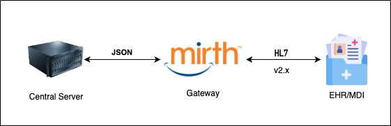

<h1>HL7 & Mirth Gateway</h1>
<h2> 🎯 Introduction </h2>

### Purpose

The Software Design Document (SDD) for the HL7 and Mirth Gateway serves to provide a comprehensive overview of the system's software architecture, design choices, components, and interfaces. It clarifies the implementation of HL7 standards through the Mirth Gateway, which acts as the communication bridge between HL7v2.x compliant healthcare providers' EHR/MDI systems and the Central Server. By adhering to Health Level Seven standards, the Mirth Gateway facilitates interoperability and smooth data exchange among EHR systems from various vendors utilizing HL7v2.x. Additionally, this document is designed to assist developers, testers, and stakeholders in comprehending the system's design, thereby enhancing development, testing, integration, and maintenance processes.

### Scope
The Mirth Gateway serves as a bridge between healthcare providers’ EHR systems and the Central server, enabling standardized, bidirectional communication using the HL7v2.x standards. It facilitates the exchange of vital and patient query data while supporting the core services of the Central Server. The communication between systems is conducted via the MLLP protocol, with all interactions routed through the public load balancer in the Central Hub system using external ingress rules.

The scope of the HL7 and Mirth Gateway includes:
- Enabling bidirectional data exchange between healthcare providers’ EHR systems and the Central server.
- Supporting HL7 plaintext communication for seamless data sharing.
- Providing functionality for creating “channels” to define data sources, transformations, and destinations.
- Efficiently handling high message volumes while maintaining system performance.
- Ensuring consistent data quality and reliability to support the Central Server and its components.

This solution is designed to address the interoperability gap in healthcare systems, facilitating seamless communication between diverse medical software systems.

### System Overview
The Mirth Gateway is a vital software component that serves as the communication interface between healthcare providers’ EHR systems and the Central server, enabling seamless and standardized interaction. Built on HL7v2.x standards, it facilitates the integration of EHR systems from multiple vendors, addressing longstanding challenges in healthcare interoperability.

**Current Message Support**:
*	The system currently supports ORU (Observation Result Unsolicited) messages, which are used to transmit clinical observations such as lab results, imaging reports, and other diagnostic data from healthcare providers to the Central server.
*	It also supports QBP (Query by Parameter) messages, enabling the Central server to query specific patient data or clinical information from the providers’ EHR systems.

**Core Functionalities**:
1.	**Standardized Communication**:
    
    Ensures all messages conform to HL7v2.x standards for reliable and consistent data exchange.
2.	**Bidirectional Messaging**:
	
    Facilitates real-time data transfer in both directions between EHR systems and the Central server.
3.	**Data Transformation**:
	
    Transforms and processes messages as required to maintain compatibility and ensure smooth integration with underlying Central server services.
4.	**Protocol and Routing**: 
    
    Uses MLLP (Minimal Lower Layer Protocol) for secure and efficient data transport.
	
    Routes all communication through the public load balancer in the Central Hub system, adhering to defined external ingress rules.
5.	**High Performance**:
	
    Capable of processing high message volumes with optimal performance to meet the demands of busy healthcare environments.

**Benefits**:
-   Enhances interoperability by enabling standardized, multi-vendor EHR integration.
-   Improves patient care with timely access to critical clinical data.
-   Provides a scalable foundation for adding support for additional HL7 message types or healthcare data standards in the future.

This enhanced functionality positions the Mirth Gateway as a robust solution for bridging the interoperability gap in healthcare systems, facilitating the efficient and reliable exchange of critical medical information.

### Definitions and Abbreviations

|Abbreviation|Definition|
|------------|----------|
|HL7|Health Level 7 - international standards for transfer of clinical and administrative data for healthcare providers|
|WSS|WebSocket Secure|
|API|Application Programming Interface|
|MLLP|Minimal Lower Layer Protocol|
|JWT|JSON Web Token|
|ADT|Admission-Discharge-Transfer|
|SAST|Static Application Security Testing|
|SCA|Software Composition Analysis|

