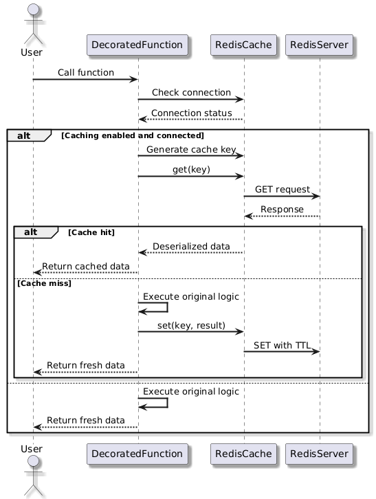
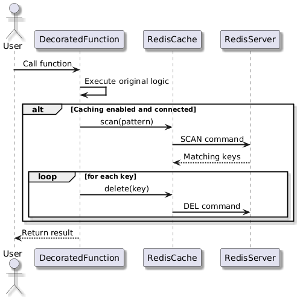

<h2>⚜️ Workflow and Algorithms</h2>

This document outlines the workflows and algorithms that govern the interactions within the Cache.

## 1. Add Cache Workflow

When a user makes an API request, the application first checks if the response exists in Redis. If found, the cached response is returned immediately. If not, the request is processed by the application logic, retrieving data from the database or performing necessary computations. The response is then stored in Redis with a defined TTL (Time-To-Live) for future use.

---

## 2. Remove Cache Workflow

When specific conditions are met, such as data updates or cache expiry, the application scans Redis for matching cache keys and deletes them.

