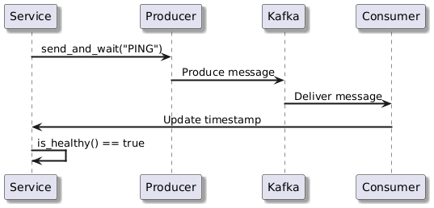
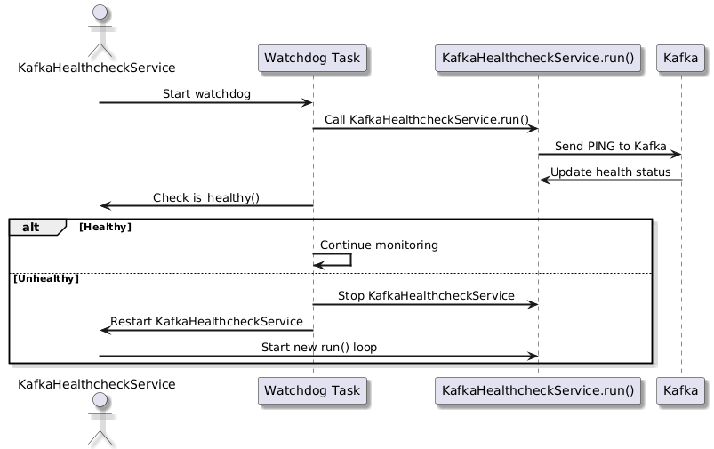

<h2>⚜️ Workflow and Algorithms</h2>

This document outlines the workflows and algorithms that govern the interactions within the Health Check.

## 1. Health Check Workflow

The health check service regularly sends a ping message to ensure everything is working fine. Once the message is received, the Consumer updates the health status of the Service. If everything is in good condition, the Service confirms that it is still healthy, and the process repeats to ensure ongoing operation.

---

## 2. WatchDog Workflow

The health check service regularly monitors the system using a watchdog task. The task sends a ping to Kafka and waits for a response. If the system is healthy, the monitoring continues. However, if an issue is detected, the watchdog will stop the health check, restart the service, and initiate a new monitoring loop.

