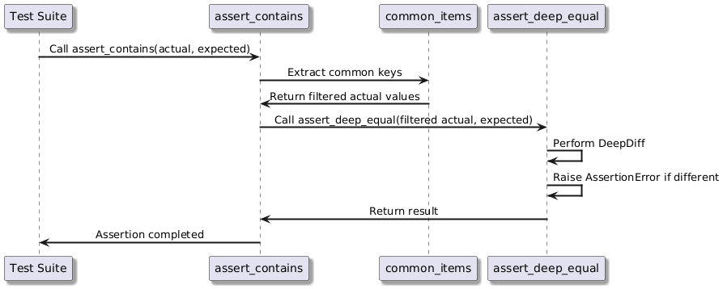
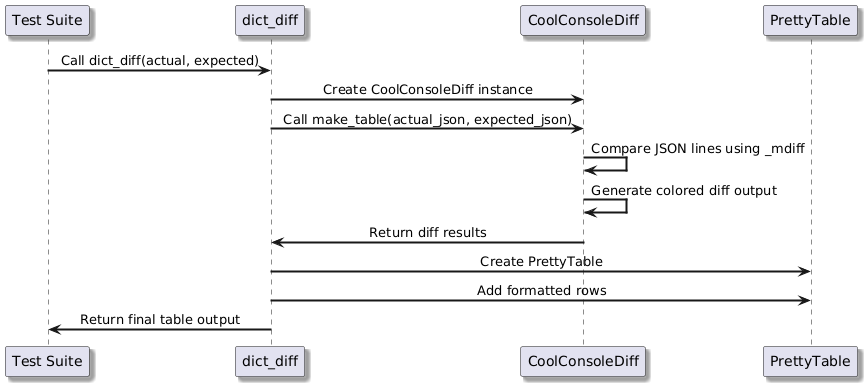

<h2>⚜️ Workflow and Algorithms</h2>

This document outlines the workflows and algorithms that govern the interactions within the Health Check.

## 1. Assert Workflow

The function checks if an actual data set includes all expected values, comparing only shared elements and raising an error if mismatches are found.

---

## 2. Display Workflow

The function compares two data sets, highlights their differences, and formats them in a structured table for easy readability.

