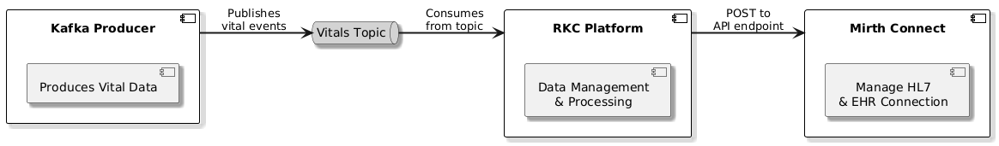

<div align="center">
<h2>⚜️ Component Design Description</h2>
</div>

### **High Level System Architecture**

The RKC Platform is the data management and processing component within the system. It is responsible for receiving, managing, and processing vital event data, ensuring that the data flows smoothly between system components.



#### **System Components**

- **Kafka Producer**:  
  A component responsible for publishing vital data.

- **RKC Platform**:  
  The core data management and processing system responsible for handling vital data.  
  - **Functionality**:  
    Consumes vital data from the **Vitals Topic**, processes it, and prepares it for integration with external systems.  
  - **Integration**:  
    Sends processed data to **Mirth Connect** via API endpoints for further EHR (Electronic Health Record) integration.

- **Mirth Connect**:  
  A healthcare integration engine that manages HL7 (Health Level 7) messaging and EHR connections.
---

### **RKC Flow Architecture**

The system begins with Kafka sending vital data to a Kafka Consumer, which forwards it to a Stream Consumer. The data is then passed through a Message Channel to a processor that organizes and stores it. Another processor regularly checks the stored data and sends it to Mirth. At the same time, the system tracks which data has been processed and ensures everything runs smoothly. If any errors occur, they are handled, and the system’s health is continuously monitored to keep everything functioning properly.


---

### **Environment Configuration**

The following .env file contains the necessary environment settings for development and deployment.
```
RUST_INFO=
KAFKA_SERVER=
KAFKA_TOPICS=
KAFKA_GROUP=
KAFKA_PASSWORD=
KAFKA_CA_FILE_PATH=
KAFKA_CERT_FILE_PATH=
KAFKA_KEY_FILE_PATH=
ENVIRONMENT=local
SENTRY_DSN=
SIBEL_VERSION=
VITALS_EXPORT_ENABLED=
VITALS_FLUSH_ENDPOINT=
VITALS_FLUSH_TIMEOUT_SECONDS=
```