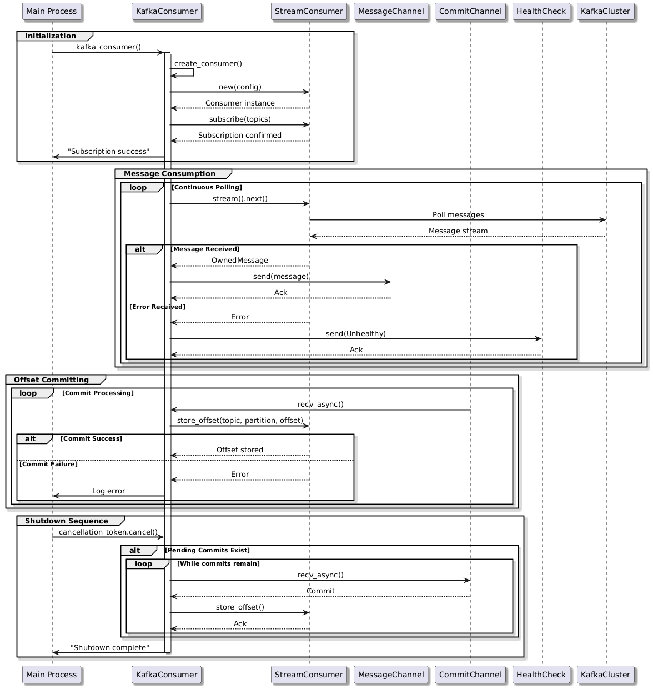

<h2>⚜️ Workflow and Algorithms</h2>

This document outlines the workflows and algorithms that govern the interactions within the RKC.

## Overview

The RKC is designed to handle Kafka messages and process them in a concurrent way. Below are the main workflows covered:

## 1. VitalsExport Workflow

VitalsExport is a processor that receives Kafka messages, parses them, and stores them in a shared HashMap if they are "NEW_METRICS" events. It uses a flume receiver to get messages and a Mutex for thread-safe access to the records. The key part is storing messages only if they have a newer timestamp than existing ones.

---

## 2. VitalsFlusher Workflow

VitalsFlusher is responsible for periodically sending the collected records to an HTTP endpoint. It locks the records, generates payloads, and sends them. On success, it clears the records and sends commit messages. It also handles graceful shutdown by committing remaining records.

---

## 3. KafkaConsumer Workflow

The KafkaConsumer covers the initialization, message consumption, offset committing, and graceful shutdown, ensuring continuous message processing, error handling, and resource cleanup.

