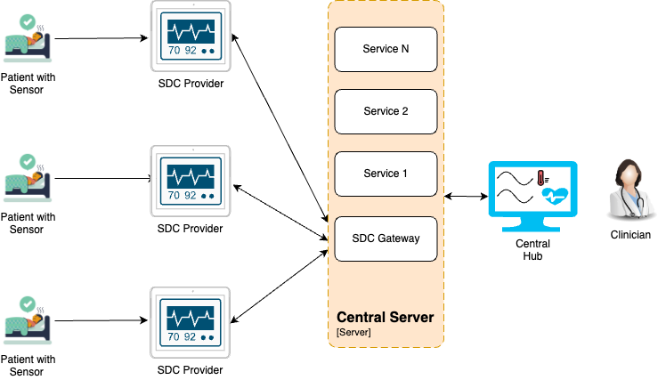
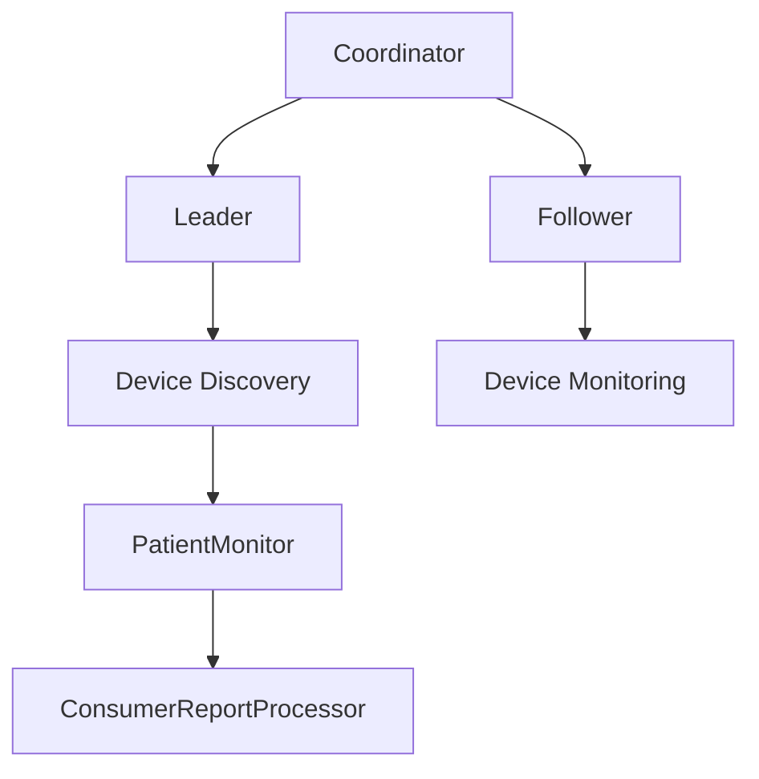

<div align="center">
<h1>SDC Gateway</h1>
<h2> 🏛️ System Architecture </h2>
</div>

### **High Level System Architecture**

The system components involved in the architecture where sensors are connected to a SDC Provider(patient monitor), which is then connected to a server over the hospital network using the SDC protocol, and where the SDC Gateway consumes patient data and displays the results on a Central Server monitored by a clinician, are as follows:



  * **Sensors**:
      
    These are medical sensors that collect various physiological data from the patient, such as heart rate, blood pressure, oxygen levels, etc.
    The sensors are connected to the SDC Provide to transmit the collected data. Sensor types includes Sibel Sensors as well as OEM Sensors.

  * **SDC Provider (Patient Monitor)**:
      
    The patient monitor which is SDC Provider is a device that receives data from the sensors and processes it.
    It acts as an intermediary between the sensors and the hospital network, ensuring that the data is correctly formatted and ready for transmission.
    The SDC Provider is connected to the hospital network using the SDC (Service-Oriented Device Connectivity) protocol, which allows for secure and standardized data exchange.
  
  * **Hospital Network**:

    The hospital network is the infrastructure that connects various medical devices and systems within the hospital.
    It enables the transmission of data between the pSDC Provider and the server.
    The network ensures that data is transmitted securely and efficiently, adhering to the SDC protocol standards.
    
  * **Central Server**:

    The server is a centralized system that receives and stores patient data from the patient monitor.
    SDC Gateway is one of the component of Server
    It processes the data for further analysis and storage, making it available for retrieval and display.
    The server is connected to the hospital network and is responsible for managing the data flow and ensuring data integrity and security.

  * **SDC Gateway**:

    The SDC Gateway is a critical component that consumes the patient data from the server.
    It processes the data and prepares it for display on the frontend.
    The gateway ensures that the data is correctly formatted and securely transmitted to the frontend systems.

  * **Central Hub**:

    The Central Hub is the user interface where clinicians can view the processed patient data.
    It displays real-time data, alarms, and other relevant information that clinicians need to monitor patient health.
    The Central Hub is typically accessed via central monitoring station(Desktop Application), allowing clinicians to monitor patients from various locations within the hospital.
    
  * **Clinician**:

    The clinician is the end user who monitors the patient data displayed on the frontend.
    They use the information to make clinical decisions, manage patient care, and respond to any alarms or alerts generated by the system.

### **SDC Gateway Flow Architecture**
```mermaid
flowchart TB
    subgraph sdc-leader
        Coordinator[Coordinator] --> LeaderTask[LeaderTask]
    end
    
    subgraph sdc-follower
        Coordinator_F[Coordinator] --> FollowerTask[FollowerTask]
        FollowerTask --> ConsumerReportProcessor[ConsumerReportProcessor]
        FollowerTask --> DeviceConnectionCheckTask[DeviceConnectionCheckTask]
    end

    Redis[(Redis)] -->|GET/SET| Coordinator
    Redis[(Redis)] -->|GET/SET| Coordinator_F
    Redis -->|SUB| FollowerTask
    LeaderTask -->|PUB| Redis

    SDCProvider -->|probe| LeaderTask
    SDCProvider -->|check connected| DeviceConnectionCheckTask
    SDCProvider -->|vitals/alert| ConsumerReportProcessor
    
    Kafka[(Kafka)] -->|ping SDCProvider connected| DeviceConnectionCheckTask
    ConsumerReportProcessor -->|vitals/alerts| Kafka

    style Redis fill:#f9c9c9,stroke:#333,stroke-width:2px,color:#000
    style Kafka fill:#b3d9ff,stroke:#333,stroke-width:2px,color:#000
    style SDCProvider fill:#a4dff4,stroke:#333,stroke-width:2px,color:#000
  ```
The diagram represents the architecture of the SDC Gateway system, which facilitates communication, data processing, and coordination between components such as Redis, Kafka, and various services (LeaderTask, FollowerTask, etc.). It involves both leader and follower roles, which interact with connected devices (e.g., SDC Provider) and external systems.

**Patient Monitor**
  - Patient Monitor act as a SDC Provider.
	-	Represents a connected device with Sensors.
	-	Sends Paient data, vitals, alert data to the ConsumerReportProcessor.
	-	Receives probes from the LeaderTask to check connectivity.
	-	Allows the system to verify connectivity through the DeviceConnectionCheckTask.
  - Continuously sends vitals and alerts to the system.
  - Responds to probes and connection checks from leader and follower tasks.


- **Redis**
  - Acts as the intermediary data store for the system.
  - Supports the following operations:
	  
    - PUB: Identifying new patient monitor devices and allocating them to a follower instance. The dissemination of patient monitor devices to the follower instances takes place via Redis 
    - SUB: The FollowerTask functions on each follower instance, subscribing to Redis acquiring its designated patient monitor device.
  - Handles PUB/SUB messages and GET/SET operations for data persistence.

- **Kafka**
	- Kafka serves as the message broker in the architecture.
  - The service shall handle the subscriptions to waveform data, technical metrics, physiological metrics, and the corresponding alerts. 
  - All incoming data shall be sent to Kafka so that the Realtime gateway can consume it.
  - Ensures device connection statuses are updated and validated
	- Key Responsibilities:
	  - Sends Device, Vitals, Waves, alerts and all data events to paient and realtime gateway services.

### **SDC Gateway Class Diagram**

```mermaid
classDiagram
    class org.sibel {
    }
    class models {
    }
    class producers {
    }
    class mdib {
    }
    class tasks {
    }
    class emulator {
    }
    class dataProcessors {
    }
    class Consumer {
    }
    class Producer {
    }
    class utils {
    }
    class jsonAdapters {
    }
    class di {
    }
    class factories {
    }
    class exceptions {
    }
    class config {
    }
    class constants {
    }

    org.sibel --> models
    org.sibel --> producers
    org.sibel --> mdib
    org.sibel --> tasks
    org.sibel --> emulator
    org.sibel --> dataProcessors

    tasks --> Consumer
    emulator --> Producer

    Consumer --> utils
    Producer --> utils

    dataProcessors --> models
    dataProcessors --> tasks

    utils --> di
    di --> factories

    jsonAdapters --> di
    di --> factories

    di --> jsonAdapters
    org.sibel --> exceptions
    org.sibel --> config
    org.sibel --> constants
```
|Package Name|Description|
|------------|-----------|
|Consumer|Independent to the packages, this class is responsible for loading and running the main application thread.|
|Tasks|It contains all other tasks that run in parallel for the application, and each task is responsible for a specific purpose and runs on its own thread.|
|DataProcessors|It contains the data processors classes where each class is responsible for parsing the data obtained from a specific event from the patient monitor (i.e, alerts, vitals, metrics, body position etc.) into Kafka messages consumed by other software components.|
|Producers|It contains the producer which is responsible for sending the messages to Kafka.|
|Models|It contains all the data classes that are used by other software components in the Central Server. There is a data class for each Kafka event and its sub structure.|
|Utils|It contains the utilities for the startup of both the Consumer and Provider classes. It also includes the utilities for parsing jar commands, reading the device network interfaces, and more.|
|Di|It contains the utilities for the dependency injection library which is Google inject.|
|JsonAdapters|It contains the jsonAdapter class that parses and serializes the models to json format; it is needed by the json parsing library instantiated by the di module (Gson from Google).|
|Factories|It contains factories used to decouple other packages so that each package is testable and manageable for dependency injection.|
|Exceptions|It contains all the custom internal exception classes.|
|Config|It contains helper classes in order to read the environment variables and configuration files required by the Central Server.|
|Constants|It contains all constant values and enums used by the application.|
|Producer|This class contains an additional main method for running a provider in order to serve as an emulator for the SDC Provider. This is used only for the testing purposes.|
|Emulator|It contains helper classes in order to emulate the SDC Providers.|
|Mdib|It contains helper classes in order to create the MDIB events that are generated by the SDC Providers.|

### **Component Design**




Detailed explanations of each component’s behavior:
-   CoordinatorTask
    -   Runs on both leader and follower.
    -   Determines instance type via environment variables or mutual communication (Redis).
-   LeaderTask
    -   Operates on the leader instance.
    -   Identifies SDC Provider devices and allocates them to follower instances via Redis PUB/SUB.
-   FollowerTask
    -   Subscribes to Redis to acquire assigned devices.
    -   Initializes ConsumerReportProcessor and DeviceConnectionCheckTask.

| Class Name | Detail |
|------------|----------|
| Corodinator |The CoordinatorTaskImpl class is part of the org.sibel.tasks package and is responsible for coordinating the roles and tasks of a distributed system, including leader and follower operations. It uses Redis for synchronization and coordination between instances and determines the system’s leadership status dynamically.| 
| LeaderTask | The LeaderTask class in the org.sibel.tasks package implements the Callable interface and represents the behavior and responsibilities of the leader in a distributed system. The leader performs tasks like device discovery and assignment, ensuring efficient resource allocation and management of connected devices.|
| FollowerTask |  The FollowerTask class in the org.sibel.tasks package implements the Callable interface and represents a follower in a distributed system. The follower’s primary responsibilities include handling discovered devices, monitoring connected devices, and cleaning up tasks when stopped.|
| PatientMonitor | The PatientMonitor class is a central manager that interacts with a SDC Provider device, handling its connection, disconnection, event processing, patient session management, and integration with external systems like Kafka and Redis. The PatientMonitor class in the given code is a comprehensive implementation managing various aspects of a patient monitoring system. |
| ConsumerReportProcessor | This is a comprehensive class from the org.sibel.tasks package that handles incoming reports and state modifications on the provider side. The ConsumerReportProcessor class observes and processes changes in different aspects of the medical device integration (e.g., components, metrics, alerts, context, and waveform). |

The sequential representation of the aforementioned classes is illustrated below. This sequence diagram highlights the interactions among the classes, emphasizing the order of messages exchanged to fulfill the scenario's functionality. Each class is depicted with its lifeline, and messages are represented by arrows indicating the flow of communication. This diagram serves as a visual guide to understanding the dynamic behavior of the SDC Gateway.

  ```mermaid
  %% Sequence Diagram
sequenceDiagram
    participant Coordinator
    participant Leader
    participant Follower
    participant PatientMonitor
    participant ConsumerReportProcessor

    Coordinator->>Leader: Assign tasks
    Leader->>Follower: Discover devices
    Follower->>PatientMonitor: Monitor devices
    PatientMonitor->>ConsumerReportProcessor: Process reports
```