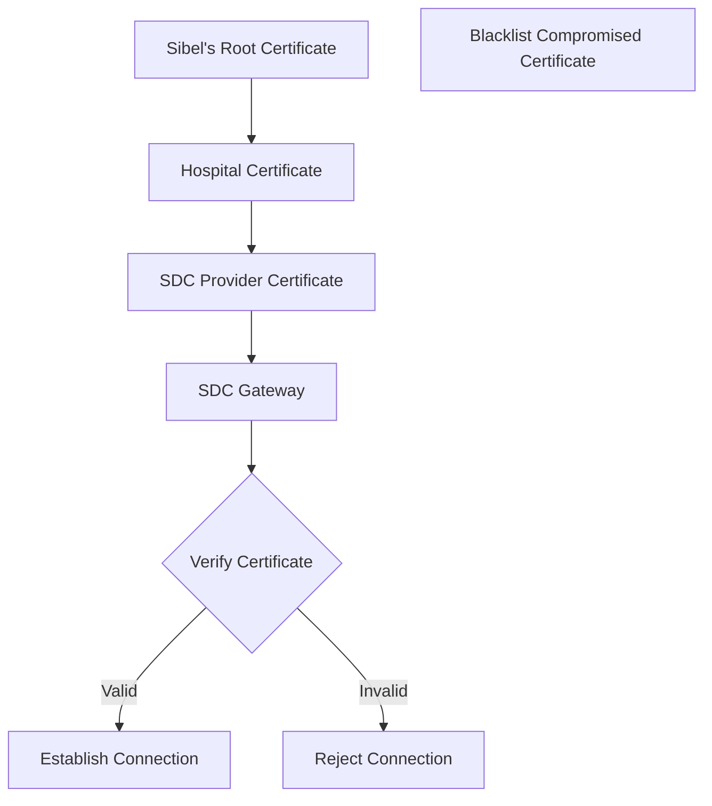
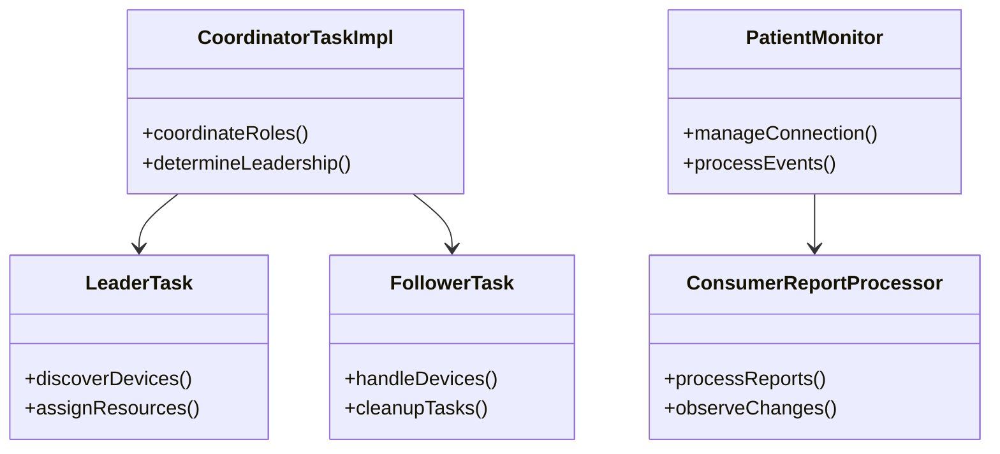
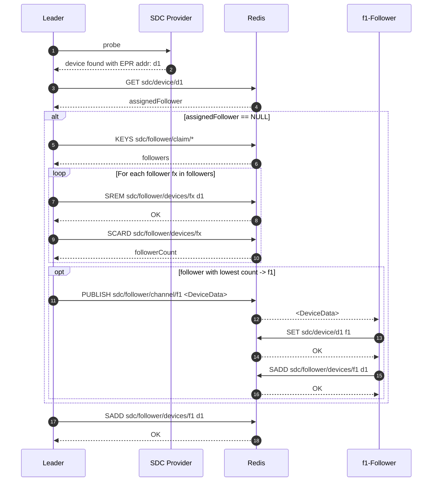
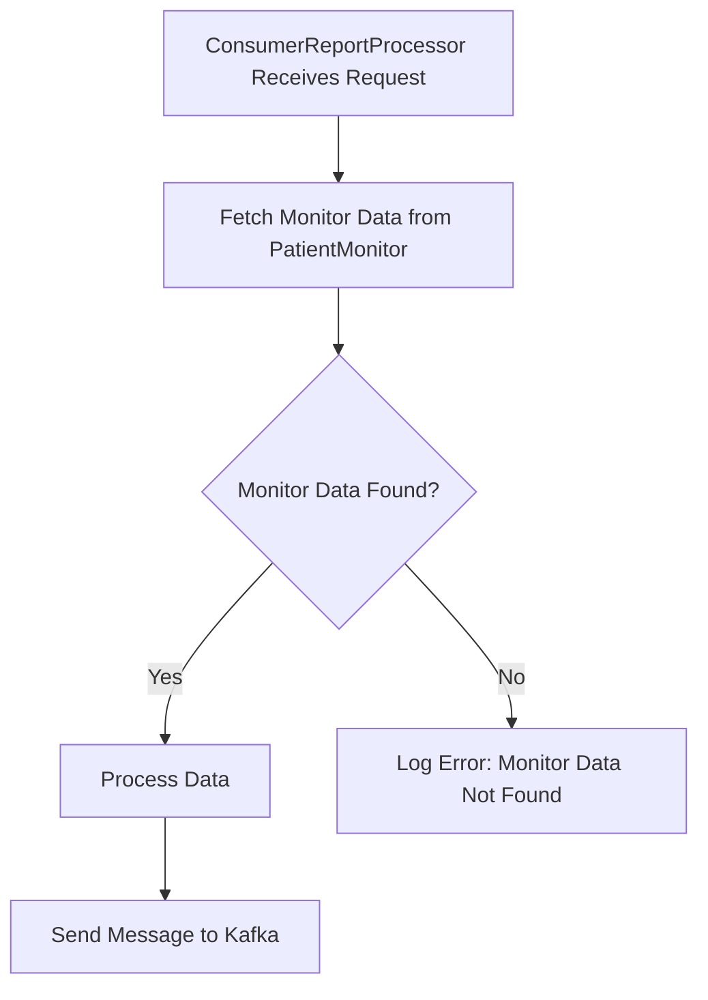

<div align="center">
<h1>SDC Gateway</h1>
<h2> ⚜️ Detailed Design </h2>
</div>

### SDC Authentication

The SDC Gateway (SDC GW) authentication is implemented using certificates. The root certificate of the certificate chain is issued by Sibel and expedited by ssl.com. Each hospital will have its own x.509 certificate, which is a child of Sibel’s root certificate. The hospital certificate is securely stored in the Central Server's Kubernetes (K8s) cluster.

#### Authentication Process


1. **Certificate Chain**:
   - **Sibel’s Root Certificate**: The root certificate of the certificate chain issued by Sibel and expedited by ssl.com.
   - **Hospital Certificate**: Each hospital has its own certificate, which is a child of Sibel’s root certificate. This certificate is securely stored in the Central Server's K8s cluster.


2. **Connection Establishment**:
   - When a SDC Provider with a certificate that is a child of the hospital's root certificate attempts to establish a connection with the SDC GW, the gateway verifies whether this certificate is a direct child of the hospital's root certificate.
   - If the verification is successful, the connection is established. If not, the connection attempt is rejected.

#### Handling Compromised Certificates

In the event that a SDC Provider's certificate is compromised, that certificate can be blacklisted. This ensures that other SDC Providers are not impacted and continue to operate securely.



### Component Class Diagram


### Device Discovery Process

The following diagram provides a detailed illustration of the device discovery process and the interactions between the leader and follower services.



*   Device Discovery and Queue Processing:
    
    -   Upon completion of the scan, the SDC service shall dispatch the discovered devices to a processing queue.
    -   This queue shall be consumed by a set of threads responsible for checking the monitoring status of each device.
    -   If the device is not being monitored, the service shall initiate device monitoring.
    -   If the device is already being monitored, the service shall disregard the device.

*   Device Monitoring and Event Subscription:
    -   As part of the device monitoring process, the service shall subscribe to events incoming from the device using the IEEE 11073 protocol.
    -   Upon successful subscription, the service shall receive HTTPS calls for each new event.
    -   The report processor shall define the handling of incoming messages.
    -   The service shall manage subscriptions to the following data types:
        1.  Waveform data
        2.  Technical metrics
        3.  Physiological metrics
        4.  Corresponding alerts

*   Data Transmission to Kafka:
    -   All incoming data shall be transmitted to Kafka, enabling the Realtime gateway to consume it.

###  Patient Admission Process

*   **Patient Search**: 

    Using the patient's identifiers, or demographic information such as the patient name, date of birth, or sex to search for a patient. The Central Server would filter through the database of patients to produce the relevant patient and their associated details.

_Patient Search from SDC Provider_


_Patient Search from SDC Consumer_


*   Quick Admission: 

    A user-driven process that commences a session for an unidentified patient, by assigning a generated patient ID.

_Quick Admission from SDC Provider_


_Quick Admission from SDC Consumer_


### SDC Event Processing flow



####   **Event Handlers**
The class uses the EventBus framework for subscribing to different types of state modifications.
-   Key subscribed events include:
    -   onComponentChange: Handles changes in component states (e.g., battery status).
    -   onMetricChange: Processes changes in device metrics.
	-   onWaveformChange: Responds to waveform state changes.
	-   onContextChange: Handles context modifications (e.g., patient assignments).
	-   onAlertChange: Processes alerts (e.g., physiological or configuration-related).

The following sequence diagram illustrates the flow for the Metrics change event. This flow is consistent across all other events.
```mermaid
sequenceDiagram
    participant ComponentStateModificationMessage
    participant ConsumerReportProcessor
    participant ProcessorFactory
    participant KafkaMessageProducer

    ComponentStateModificationMessage->>ConsumerReportProcessor: onMetricChange
    ConsumerReportProcessor->>ProcessorFactory: createMetricChangeProcessor(mdibAccess, state, patientId)
    ProcessorFactory-->>ConsumerReportProcessor: MetricChangeProcessor
    ConsumerReportProcessor->>KafkaMessageProducer: notify(brokerMessage, MESSAGE_BROKER_VITALS_TOPIC, patientId)
    KafkaMessageProducer-->>ConsumerReportProcessor: Ack/Exception
  ```