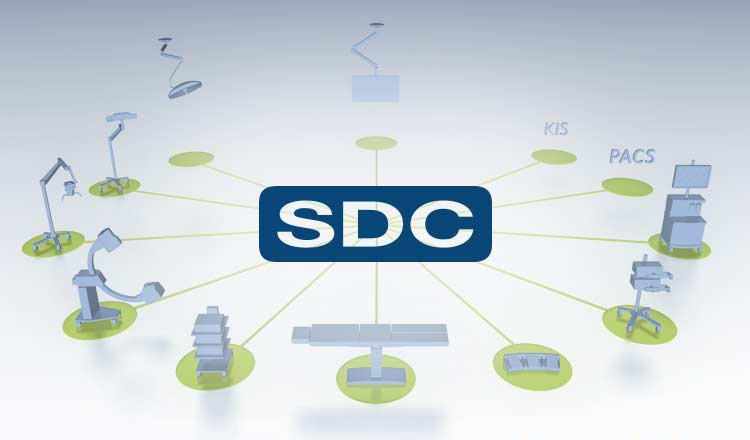

<h1>SDC Gateway</h1>
<h2> 🎯 Introduction </h2>

### Purpose

The purpose of the Software Design Document for the SDC Gateway is to provide a detailed description of the system’s software architecture, design decisions, components, and interfaces. This document ensures clarity in the implementation of the SDC Gateway, which serves as the communication interface between IEEE 11073-compatible patient monitors and the Central server. By leveraging the IEEE 11073-SDC standards, the SDC Gateway enables interoperability and seamless communication among medical devices from various manufacturers. The document also aims to support developers, testers, and stakeholders in understanding the system’s design to facilitate development, testing, integration, and maintenance.

### Scope
The SDC Gateway acts as a bridge between patient monitors and the Central server to enable standardized, bidirectional communication using the IEEE 11073-SDC standards. The software is built upon the SDC Reference Implementation (SDC-RI) project and relies on the following core libraries:
-   DWPS: Enables device discovery over the network.
-	Biceps: Provides the communication protocol for exchanging data between devices.
-   Glue: Integrates DWPS and Biceps into a cohesive system.
The SDC Gateway functions as a gateway service that interacts with the SDC Provider to retrieve, process, and transform data before relaying it to the Kafka service, enabling support for underlying services.

Current code implementation consume the standard requirement from below list of IEEE 11073 SDC Family standard. 

    - ISO IEEE 11073-20701-2020 
    - ISO IEEE 11073-20702-2016
    - ISO IEEE 11073-10207-2017
    - ISO IEEE 11073-10101-2020

The scope of the SDC Gateway includes:
-   Bidirectional data transfer between SDC Provider and the Central server.
-   Device discovery for IEEE 11073-compatible patient monitors which is Explicit device disovery method.
-   Support for high-quality, standardized communication beyond manufacturer boundaries.
-   Facilitating remote control of individual device functions as of now used for Patient data exchange.
-   Ensuring consistent data quality and reliability for patient monitoring systems.

The Solution is targeted at addressing the interoperability gap in healthcare systems for medical device communication, which DICOM and HL7 standards have not fully addressed. 

### System Overview
The SDC Gateway is a software component that serves as the communication interface between patient monitors compliant with IEEE 11073 standards and the Central server. It enables standardized and seamless communication among devices from multiple manufacturers, overcoming the historical challenges of interoperability in healthcare systems.

The system leverages the SDC Reference Implementation (SDC-RI) libraries, which include:
1.	DWPS: Handles the discovery of devices over the network, ensuring that patient monitors can be detected and connected efficiently.
2.	Biceps: Facilitates the communication protocol, enabling bidirectional data transfer and remote control of medical devices.
3.	Glue: Integrates DWPS and Biceps libraries into a unified solution, ensuring smooth operation and interaction between components.

The SDC Gateway fulfills the following critical functions:
*	Bidirectional Data Transfer: Enables exchange of patient context and critical data between devices and the Central server.
*	Remote Control: Allows control over specific device functionalities to ensure dynamic interaction.
*	Standardized Communication: Ensures consistent and high-quality data transfer using IEEE 11073 standards.

### Definitions and Abbreviations
|Abbreviation|Definition|
|------------|----------|
|SDC|IEEE 11073 service-oriented device connectivity (SDC)|
|PM|Patient Monitor |
|Central Server|Central Monitoring System|
|PRE|Pre Associate Context ( IEEE 11073 SDC - SDC Consumer request to SDC Provider )|
|ASOC|Associate Context ( IEEE 11073 SDC - SDC Provider success message )|
|NO|NOT Associate Context ( IEEE 11073 SDC - SDC Provider rejection message )|

